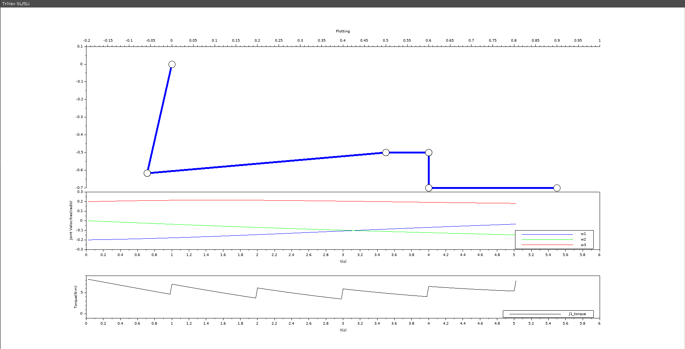

# KDP-3R-Project

See the TriVex SL/SLi vertical pacKage loader using two 3R arm robots:[TriVex](https://youtu.be/58p0063SkLE)
1. Plot the 3R motion
2. Plot of joint speeds versus time. For this, you can use the following sequence at each step of the motion:
     - Compute the pose of the end-effector
     - Solve the inverse position analysis to obtain the configuration of the robot and, in particular, the position of each joint
     - Compute the Jacobian at this configuration
     - Obtain joint speeds by multiplying the Jacobian with the required end-effector twist (joint speeds = J·T)

Optionally (as bonus) you can generate the following results:
3. Plot the torque that J1 must sustain versus time (you can consider the weight of L1 and L2 at the middle of the link, and the weight of the end-effector at the middle of g3)
4. In the function that solves the inverse position analysis of the robot, add a check to guarantee that the inputs are inside the workspace of the robot

## FILES
- **functions.sci** --> Where the functions are defined.
- **main_loop.sce** --> The main_loop, the base program that calls the functions defined in *functions.sci* and makes the execution of the project.

### functions.sci
This file consists of the following functions:
- **function[x,y,gamma] = jointPosition2EndEffectPose(theta1,theta2,theta3,L1,L2,g1,g2,g3)** --> Giving the TriVex parameters and state values *theta_1, theta_2, theta_3*, it computes the direct kinematics and obtains the position of the point P *(x,y,gamma)*.
- **function[theta1,theta2,theta3] = Endeffector2jointposition(x_,y_,gamma_,g1,g2,g3,L1,L2)** --> Giving the TriVex parameters and the position and angle of the end-effector, it computes the inverse kinematics and obtains the TriVex state values *theta_1, theta_2, theta_3* and checks if the inputs are inside the workspace of the robot.
- **function[J1,J2,J3,P_g1,P_g2,P] = ComputingJoints(theta1,theta2,gamma_,g1,g2,J1)** --> Giving the TriVex parameters and state values, it computes the position of the joints, the point *P* and the intermediate positions between *J3* and *P*.
- **function[] = PlottingPoints(J1,J2,J3,P_g1,P_g2,P)** --> Giving the joint positions calculated in the previous function, this function plot the robot position in each iteration.
- **function [J] = Jacobian(theta1,theta2,L1,L2)** --> Giving *theta1* and *theta2*, it computes the Jacobian Matrix.
- **function [thetap] = ComputingVelocities(theta1,theta2,L1,L2,v)**  -->  Giving the state variable *theta1* and *theta2* and a velocity, it computes the angular velocity of each joint and it returns an array *thetap* with all the angular velocities.
- **function[t_,thetad_1,thetad_2,thetad_3] = PlottingVelocities(thetap,t,t_,thetad_1,thetad_2,thetad_3)** --> It uses the velocity of each joint computed in the previous function so as to plot it.
- **function[T] = ComputingTorqueJ1(theta1,theta2,theta3,L1,L2,g1,g3,m_L1,m_L2,m_EF,n_prod,m_p,g,T)** --> Giving the state variables, project parameters, masses and gravity values, it returns an array with the torque values of joint J1 computed at each iteration.
- **function[] = PlottingTorque(t_,T)** --> Giving an array of times and an array torques of joint J1, this function uses it to represent the torque in J1 during the movement of the robot.

### main_loop

Giving all the  *L1,L2,g1,g2,g3* robot values, the value of joint1 *J1*,the mass of each link: *m_L1,m_L2,m_EF*,the product mass value *m_product*,the gravity constant *g*, the initial position *P_Start*, the final position *P_Final*, and the velocity of the end-effector *v*, it computes the movement that the TriVex has to do from the initial position *P_Start* to the final position *P_Final* accomplishing all the constraints.

In a loop while time is less than the distance/abs(velocity) it does the following:
1. First, obtains the state variables *(theta1,theta2,theta3)* using the inverse kinematics with the function:  **Endeffector2jointposition**
2. Second, with the state variables, it proceeds to obtain the joint positions with the function: **ComputingJoints**
3. Third, with the joint positions obtained in the previous step,it proceeds with its plotting: **PlottingPoints**.
4. Forth, it uploaded the time needed to compute the next iteration.
5. Fifth, the computed position *P_Computed* is uploaded to the next iteration adding to *P_Computed* a new differential distance computed as the (velocity*time *vt*).
6. Sixth, it computes the velocity of each joint using the function **ComputingVelocities** and it uses the function **PlottingVelocities** for plotting.
7. Finally, it computes the torque of the joint J1 using the function **ComputingTorqueJ1** and uses the function **PlottingTorque** for plotting.

